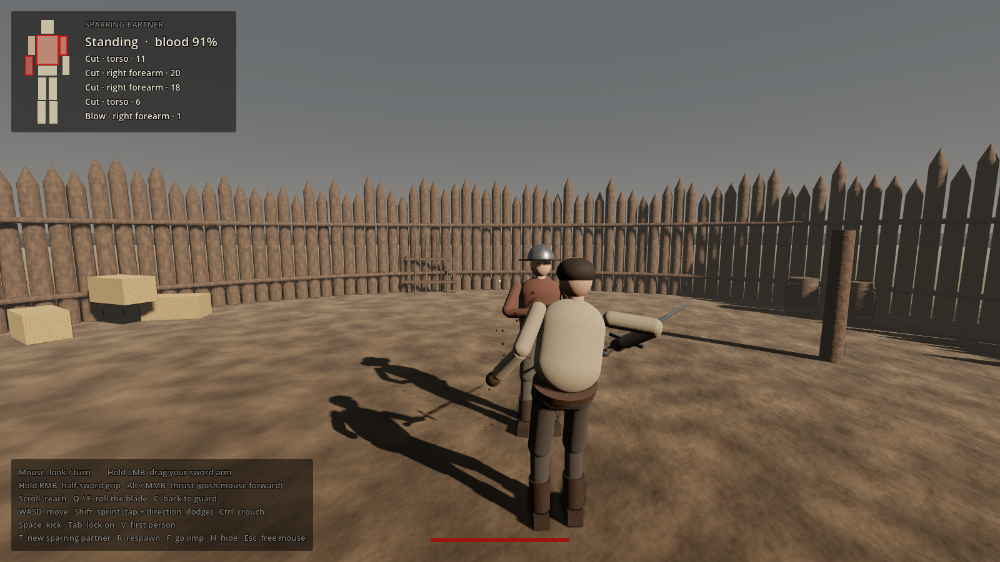

# dumbgame

A wobbly active-ragdoll sword fighting game made in **Godot 4.7**, in the
spirit of Human: Fall Flat and Half Sword. You control the sword arm directly
with the mouse, and everything, from walking to swinging and falling over, is
physics.

This first build has one character, a small test arena, a training dummy and
a sword.

## Play it

- **In your browser:** https://kierbob.github.io/dumbgame/
- **Downloads (Windows / Linux):** [latest release](https://github.com/kierbob/dumbgame/releases/tag/latest)

Both update automatically on every push to `main` (see
`.github/workflows/publish.yml`).

## Running it from source

1. Install [Godot 4.7](https://godotengine.org/download) (standard build, no
   C# needed).
2. Open Godot, click **Import**, and pick this folder's `project.godot`.
3. Press **F5** (or the ▶ button).

## Controls

| Input | Action |
| --- | --- |
| Click | Capture the mouse |
| WASD / arrows | Walk (relative to the camera) |
| Shift | Sprint |
| Space | Jump |
| Mouse | Look around |
| **Hold left mouse** | **Control the sword.** The mouse moves your fist; release to hold the pose |
| Scroll wheel | Reach in / out (thrusts) |
| Q / E | Roll the blade |
| C | Back to guard pose |
| F (hold) | Go limp |
| R | Respawn |
| H | Hide the controls card |
| Esc | Free the mouse |

Tips:

- Fast, wide mouse strokes hit hardest. The edge turns to face the direction
  of your stroke, so a clean slash lands as a **CUT** (up to 1.4× damage).
  Rolling the blade with Q/E makes it a flat **SLAP** (0.5×).
- Head hits do 1.5× damage. Hits faster than 13 m/s knock the dummy down.
- Whipping the sword around costs you balance, and the swing's reaction pushes
  on your shoulder. Flail too hard, jump, or land badly and you'll stumble or
  fall over. It gets back up on its own.
- The pad in the bottom-right shows where your fist is inside its reachable
  box. The bar next to it is your reach.

## How it works

Everything lives in `scripts/`:

- **`active_ragdoll.gd`**: the core. Builds a 13-part humanoid out of
  `RigidBody3D` capsules joined with `PinJoint3D` ball joints. Nothing is
  animated:
  - *Muscles* are PD controllers that apply torques pulling each part toward a
    target pose. Limb torques are internal (the parent gets the reaction).
  - *Balance* is an external "cheat" torque on the hips and chest, as in
    Human: Fall Flat. It has a strength cap, so heavy swings, hits and bumps
    can overpower it.
  - A *hover spring* holds the pelvis at standing height, and the legs run a
    procedural gait underneath it.
  - The *arms* use two-bone IK to aim at hand targets. The sword hand is also
    pulled toward its target by a grip force, and the equal and opposite force
    goes into the shoulder.
  - *States*: active, then knocked down (limp), then recovering (muscles ramp
    back up and the body hauls itself upright).
- **`player.gd`**: turns input into intent. It maps the mouse onto the fist
  target, points the blade away from a pivot behind the shoulder (so sweeping
  the mouse sweeps an arc), and turns the edge to follow the stroke.
- **`sword.gd`**: the sword body, built from primitives with continuous
  collision detection. It reports new contacts with their closing speed and
  how edge-on they were.
- **`dummy.gd`**: the training dummy. It runs the same ragdoll with its fists
  up, turns to face you, and walks back to its spot after being knocked around.
- **`main.gd`**, **`hud.gd`**, **`camera_rig.gd`**: hits, damage numbers,
  sounds, HUD and the over-the-shoulder camera.

Physics runs at 120 Hz on Jolt with physics interpolation enabled.

### Tuning

Most feel knobs are exported on the Player and Dummy nodes in the inspector
(Movement and Muscles groups). The important ones:

- `balance_frequency` / `balance_torque`: how stiffly you stay upright. Lower
  it for more wobble.
- `swing_wobble`: how much balance a full-speed swing costs.
- `grip_force` / `wrist_torque`: how strongly the arm drives the sword.
- `knockout_hit_speed`: how hard a hit has to be to floor the dummy.

## Assets

All third-party assets are free and CC0. See [CREDITS.md](CREDITS.md).
